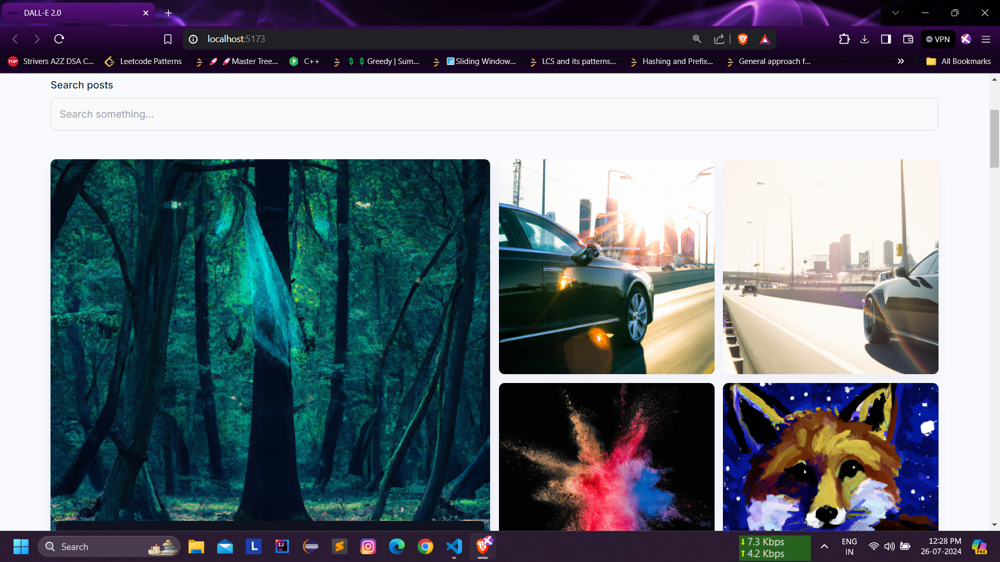

# MERN AI Image Generation App | DALL-E Clone

## Project Overview

This project is a Full Stack MERN AI Image Generation App, modeled after popular AI image generators like Midjourney and DALL-E. It allows users to input text and receive generated images, leveraging the power of OpenAI's DALL-E model. The app is built using the MERN stack (MongoDB, Express.js, React.js, Node.js), ensuring a robust and efficient performance.

## How It Works

1. *User Interface*: The frontend is built with React.js and styled using TailwindCSS. Users can input descriptive text into a user-friendly interface.
2. *Backend Processing*: The backend, powered by Node.js and Express.js, receives the text input from the frontend.
3. *AI Image Generation*: The backend communicates with OpenAI's DALL-E model, sending the text input and receiving the generated image.
4. *Image Storage*: The generated images are stored in Cloudinary, a cloud-based image storage service.
5. *Display*: The generated images are then displayed back to the user on the frontend.

## Tech Stack

- *Frontend*:
  - React.js
  - TailwindCSS
- *Backend*:
  - Node.js
  - Express.js
  - OpenAI API (DALL-E model)
- *Database*:
  - MongoDB
- *Image Storage*:
  - Cloudinary

## Demo

Check out the [demo video](https://youtu.be/EVD-cxIq74s) to see the app in action.

## Screenshots




## Getting Started

1. *Clone the repository*:
   ```bash
   git clone https://github.com/DXtR-05/mern-ai-image-generator.git
   cd mern-ai-image-generator
2. **Install dependencies**:
   ```bash
   npm install
3. *Set up environment variables:*:
   ```bash
   OPENAI_API_KEY=your_openai_api_key
   CLOUDINARY_CLOUD_NAME=your_cloudinary_cloud_name
   CLOUDINARY_API_KEY=your_cloudinary_api_key
   CLOUDINARY_API_SECRET=your_cloudinary_api_secret
4. **Run the application:**:
   ```bash
   npm run dev

## Conclusion :

This project demonstrates how to integrate advanced AI models with a modern web application stack. By leveraging the MERN stack, TailwindCSS, and Cloudinary, this app offers a seamless user experience for generating images from text input. Feel free to explore, modify, and enhance the project according to your needs. Happy coding!
